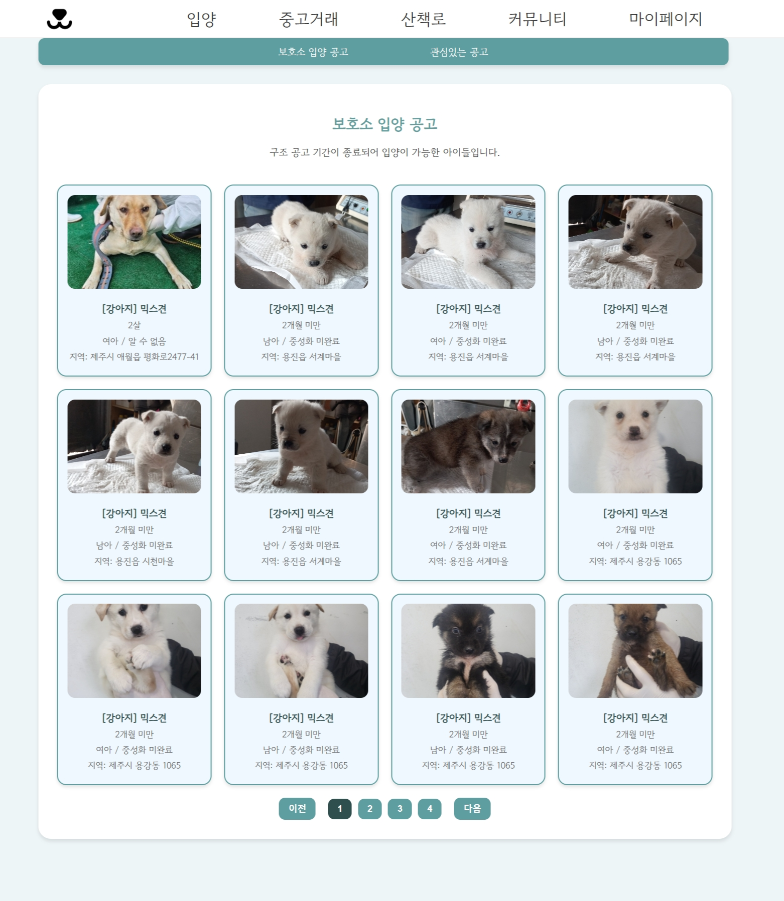
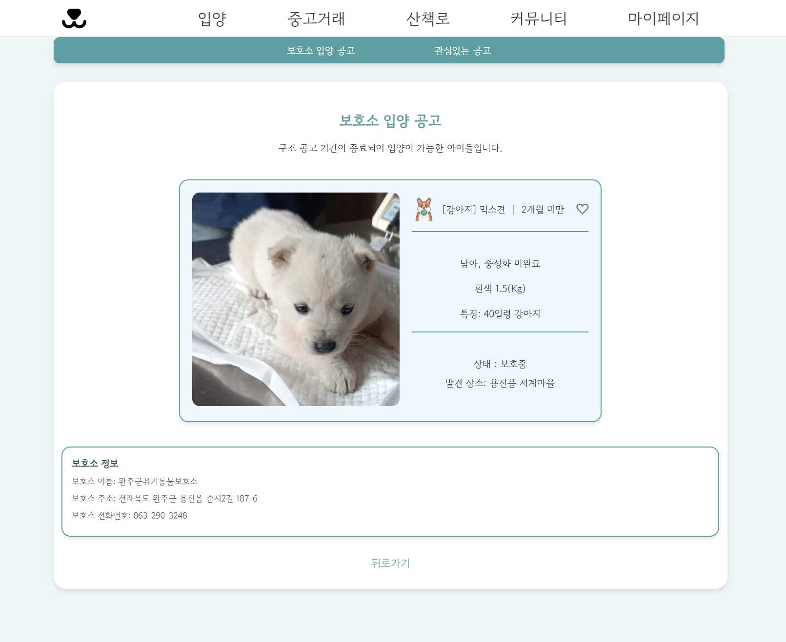
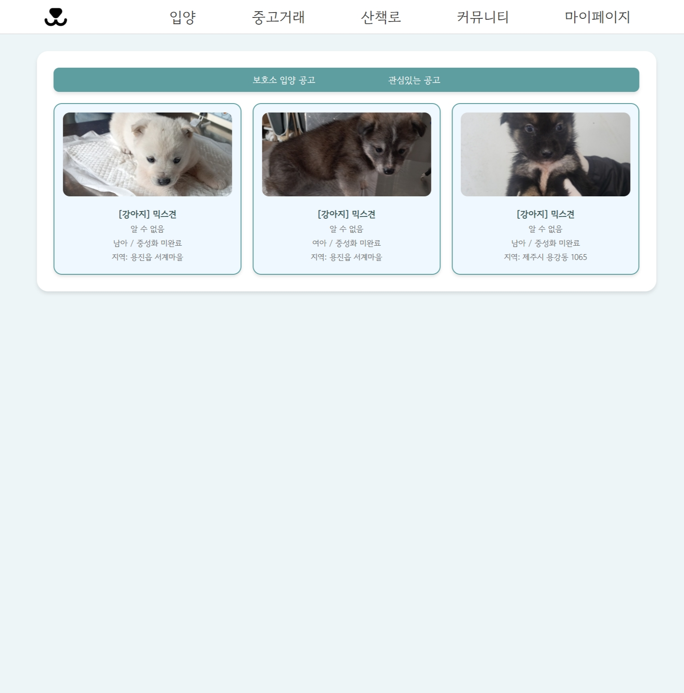

# DANGS

## 概要
DANGSは、近年のペットサービス需要の増加に対応するために設計された、  
保護犬の入養、ペット用品の取引、情報共有などを一つの場所で行える統合型プラットフォームです。

## プロジェクト情報
- 開発期間：2025年1月（3週間）
- チーム構成：5人

## 使用技術

### ◾ ツール・バージョン管理
- Eclipse
- Git / SourceTree

### ◾ データベース
- Oracle DB（Oracle Cloud使用）

### ◾ 言語・フロントエンド
- HTML / CSS / JavaScript
- JSP

## 担当ページおよび機能

### ◾ 入養情報ページ

保護中の動物に新しい家族を見つけることを目的とし、  
構造動物の保護公告を活用した入養促進を支援するページを担当しました。

実装した主な機能は以下の2つです。  
- 保護動物の入養公告の一覧表示  
- 関心動物公告（お気に入り）の登録・解除  

公告情報は、保健所や保護施設で保護されている動物たちの情報を、  
公的データポータル（Open API）からJSON形式で取得し、  
必要なデータのみを抽出してOracle DBに保存・表示しています。

## その他

### スクリーンショット

#### 入養情報ページ（一覧）

  
保護中の動物の入養公告を一覧で表示するページです。 
写真、性別、地域などの基本情報をカード形式で視覚的に整理し、
ユーザーが一目で動物の情報を把握できるように設計されています。 

#### 入養公告の詳細ページ

  
公告をクリックすると、選択した動物の詳細情報（特徴、保護場所、連絡先など）を表示します。  
公告IDをもとにデータベースから情報を取得し、詳細ページに反映させています。

#### お気に入り（関心登録）ページ

  
ユーザーが「関心登録」した公告の一覧を表示するページです。   
関心登録・解除は非同期で実装されており、ユーザー体験を損なわずスムーズに切り替えが可能です。  
