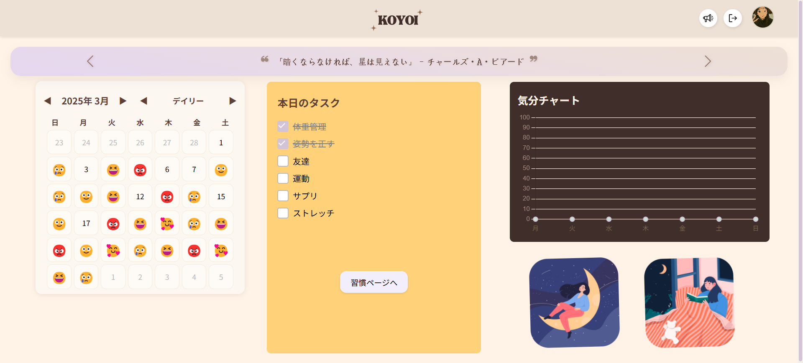
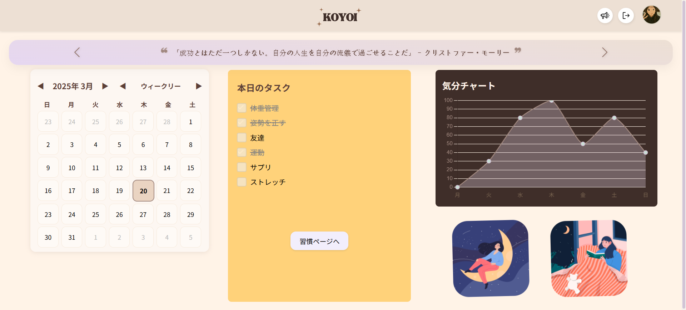
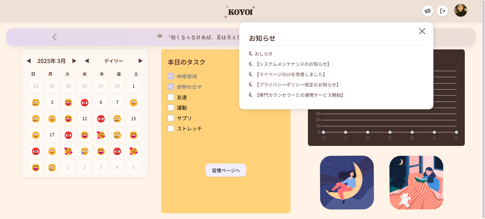
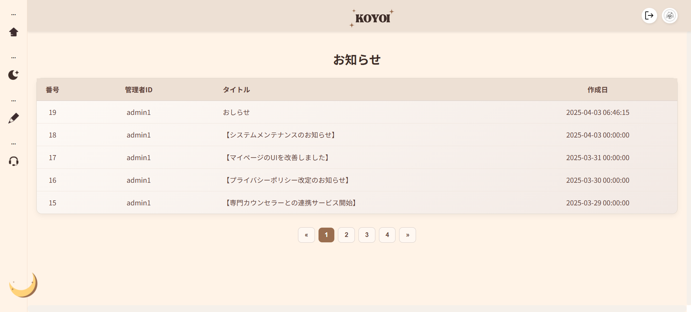
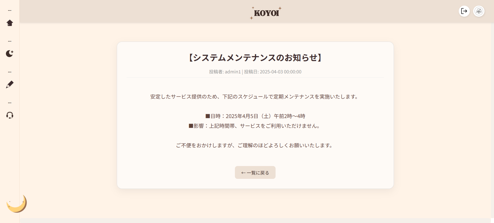
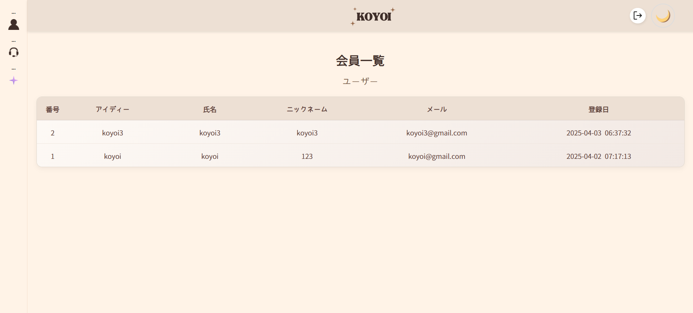
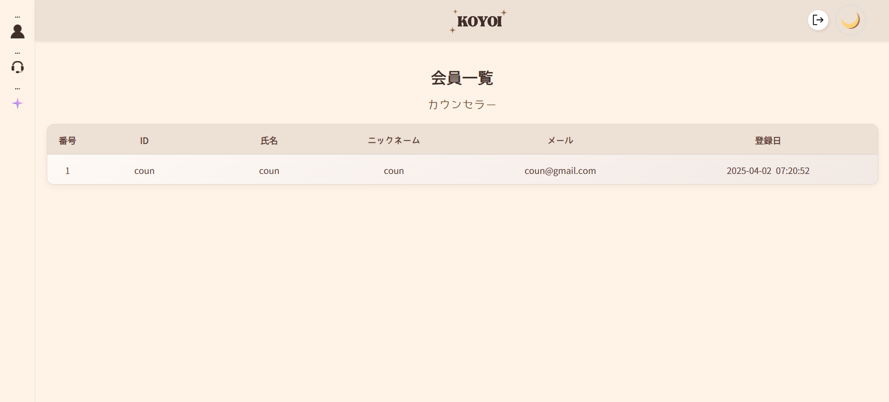
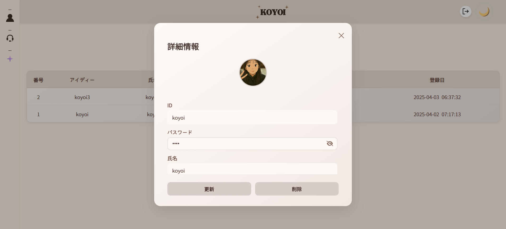
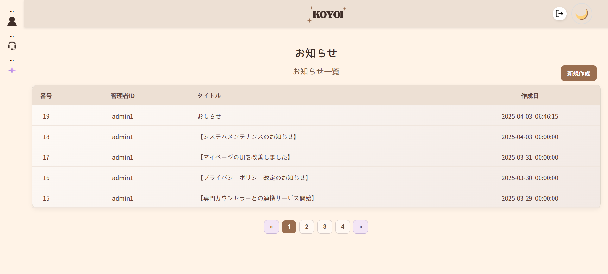
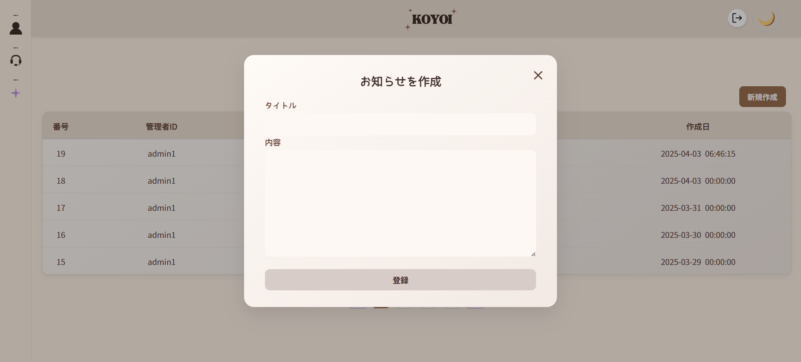

# KOYOI

## 概要

KOYOIは?
「こころがよい」という言葉から着想を得た  “⼼と向き合うWebプラットフォーム”です。

日記による感情記録、AIチャットボット、リアルタイム相談機能を通して、  
誰もが気軽に自分の気持ちを整えられるような空間を目指しています。

## プロジェクト情報

- 開発期間：2025年2月〜3月（5週間）  
- チーム構成：5人

## 使用技術

### ◾ ツール・バージョン管理
- IntelliJ  
- Git  
- Sourcetree  

### ◾ データベース
- Oracle DB（Oracle Cloud使用）

### ◾ フレームワーク
- Spring Boot  
- MyBatis  

### ◾ デザインおよびアイデア共有
- Figma（UI設計）  
- Notion（タスク・仕様管理）  
- Illustrator / Photoshop
  
### ◾ 言語・フロントエンド
- HTML / CSS / JavaScript  
- JSP

## 担当ページおよび機能

### ◾ メインページ  
- カレンダー  
- チェックリスト（当日以外は編集不可）  
- お知らせ表示（最新5件、3日以内は「NEW」タグ付き）  
- 名言スライダー（有名人の励ましの言葉を表示）

### ◾ カレンダー  
- デイリーカレンダー：日記と連動（その日の感情表示）  
- ウィークリーカレンダー：クリックでチェックリスト＆気分グラフを表示  
　　（ウィークリーモードで選択した日付に連動）

### ◾ お知らせページ  
- お知らせ一覧
- お知らせ詳細ページ

### ◾ 管理者ページ  
- 会員管理（カウンセラー／ユーザー一覧、編集、削除）  
- お知らせ管理（登録、修正、削除）  
- タブによる機能別の表示切替／モーダル表示対応

## その他

- デモ動画（後日追加予定）  
- スクリーンショット

### スクリーンショット

#### メインページ  

#### お知らせページ

#### 管理者ページ  

